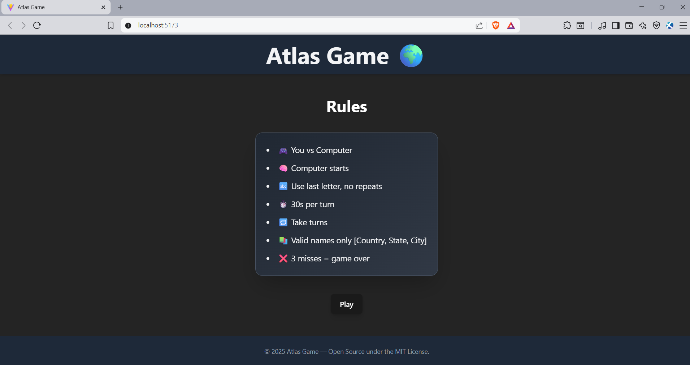
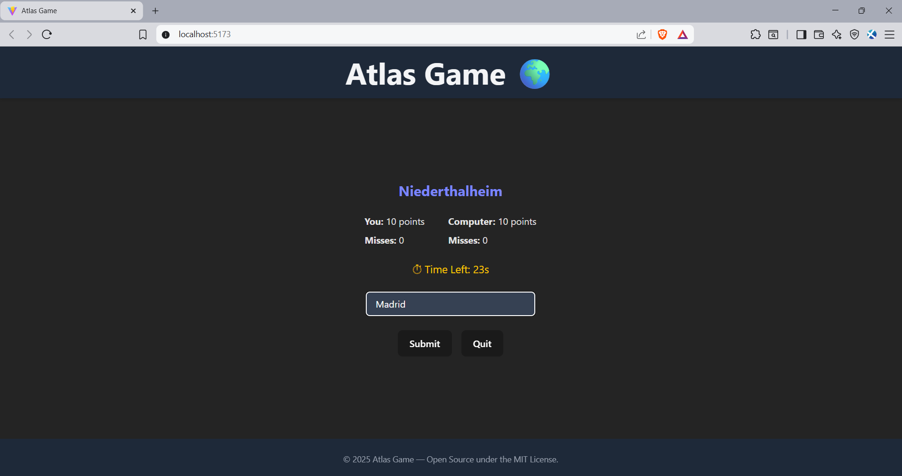
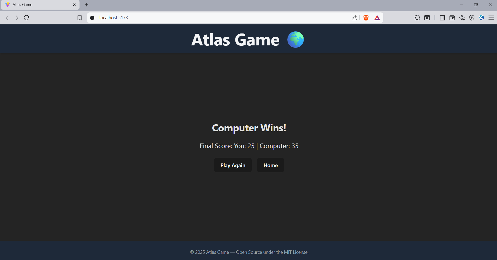

# Atlas Game🌍

A fun and interactive word game built with React and Tailwind CSS where players and the computer take turns naming places that start with the last letter of the previous word. The game challenges your memory, vocabulary, and quick thinking!

---

## 🔧 Features

- **⚡ Real-Time Gameplay**
  - Turn-based game between the user and the computer
  - Countdown timers for each turn to keep the pace fast

- **🧠 Smart Computer Opponent**
  - Uses a preloaded JSON dataset of places categorized by their starting letter
  - Randomly selects valid responses while avoiding repetition

- **🎯 Game Rules**
  - Players must name a place starting with the last letter of the opponent’s word
  - No place can be repeated in a match

- **🎨 Stylish UI**
  - Fully responsive interface using Tailwind CSS
  - Separate game board and game over screens for smooth transitions

- **📊 Score Tracking**
  - Keeps score for both the player and the computer
  - Declares a winner or a draw when no valid moves remain

---

## 📂 Directory Structure

```
├── src/                         // Main source code
│   ├── components/              // React components
│   │   ├── GameBoard.jsx
│   │   ├── GameOver.jsx
│   │   ├── Header.jsx
│   │   ├── Footer.jsx
│   │   └── LandingPage.jsx
│   ├── data/                    // Game data
│   │   └── places.json
│   ├── scripts/                 // Utility scripts
│   │   └── build-places.js
│   ├── utils/                   // Helper functions
│   │   └── gameHelpers.js
│   ├── App.jsx                   // Main app component
│   ├── main.jsx                  // Entry point
│   └── ...
├── package.json
└── README.md
```

---

## 🛠️ Run Locally

### 1. Install dependencies
```bash
npm install
```

### 2. Start development server
```bash
npm run dev
```

### 3. Open the browser
http://localhost:5173/

---

## 💻 Screenshots

### Landing Page Screen

 

### Game Board Screen



### Game Over Screen


---

## 📄 License

This project is licensed under the [MIT License](https://opensource.org/licenses/MIT).


